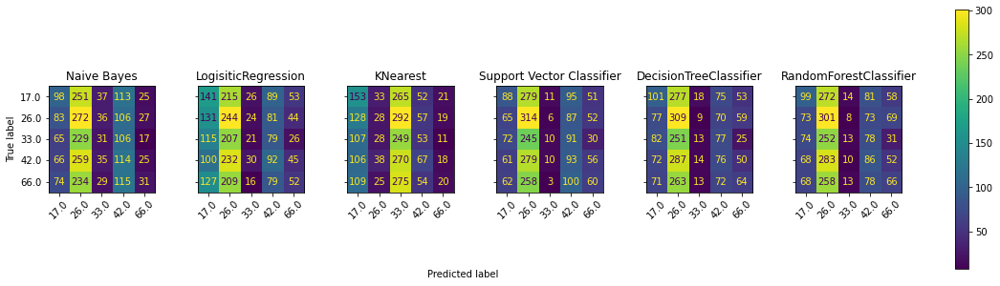

# Pawpularity Contest


## Overview

A picture is worth a thousand words. But did you know a picture can save a thousand lives? Millions of stray animals suffer on the streets or are euthanized in shelters every day around the world. You might expect pets with attractive photos to generate more interest and be adopted faster. But what makes a good picture? With the help of data science, we may be able to accurately determine a pet photo’s appeal and even suggest improvements to give these rescue animals a higher chance of loving homes.

## Business Understanding

<a href="https://www.petfinder.my/">PetFinder.my</a> is Malaysia’s leading animal welfare platform, featuring over 180,000 animals with 54,000 happily adopted. PetFinder collaborates closely with animal lovers, media, corporations, and global organizations to improve animal welfare.

Currently, PetFinder.my uses a basic Cuteness Meter to rank pet photos. It analyzes picture composition and other factors compared to the performance of thousands of pet profiles. While this basic tool is helpful, it's still in an experimental stage and the algorithm could be improved. In this notebook, we attempt to create an entirely new tool that PetFinder can use to predict the "pawpularity" of an animal profile, based on the profile image. As a result, stray dogs and cats can find their "furever" homes much faster. 

## Technical Understanding

In this project, we will first explore the data given to us from petfinder.my. We will look at the characteristics of our data in a piecemeal approach for maximum understanding before visualizing each against our target variable, pawpularity. Next, we will go through an iterative modeling process. Since this a regression task, we have elected to use RMSE as our performance metric. We will eventually converge on a final model after exhausting our resources to our best abilities. Finally, we will analyze our results, draw conclusions, and make suggestions on where to iterate on our current process for improvements. 

## Data Understanding

For this project, we have historical data from the PetFinder.my website composed of almost 10,000 images and hand-labeled metadata per image. 

Here is a preview of the metadata. 

<div>
<table border="1" class="dataframe">
  <thead>
    <tr style="text-align: right;">
      <th></th>
      <th>Id</th>
      <th>Subject Focus</th>
      <th>Eyes</th>
      <th>Face</th>
      <th>Near</th>
      <th>Action</th>
      <th>Accessory</th>
      <th>Group</th>
      <th>Collage</th>
      <th>Human</th>
      <th>Occlusion</th>
      <th>Info</th>
      <th>Blur</th>
      <th>Pawpularity</th>
    </tr>
  </thead>
  <tbody>
    <tr>
      <th>0</th>
      <td>0007de18844b0dbbb5e1f607da0606e0</td>
      <td>0</td>
      <td>1</td>
      <td>1</td>
      <td>1</td>
      <td>0</td>
      <td>0</td>
      <td>1</td>
      <td>0</td>
      <td>0</td>
      <td>0</td>
      <td>0</td>
      <td>0</td>
      <td>63</td>
    </tr>
    <tr>
      <th>1</th>
      <td>0009c66b9439883ba2750fb825e1d7db</td>
      <td>0</td>
      <td>1</td>
      <td>1</td>
      <td>0</td>
      <td>0</td>
      <td>0</td>
      <td>0</td>
      <td>0</td>
      <td>0</td>
      <td>0</td>
      <td>0</td>
      <td>0</td>
      <td>42</td>
    </tr>
    <tr>
      <th>2</th>
      <td>0013fd999caf9a3efe1352ca1b0d937e</td>
      <td>0</td>
      <td>1</td>
      <td>1</td>
      <td>1</td>
      <td>0</td>
      <td>0</td>
      <td>0</td>
      <td>0</td>
      <td>1</td>
      <td>1</td>
      <td>0</td>
      <td>0</td>
      <td>28</td>
    </tr>
    <tr>
      <th>3</th>
      <td>0018df346ac9c1d8413cfcc888ca8246</td>
      <td>0</td>
      <td>1</td>
      <td>1</td>
      <td>1</td>
      <td>0</td>
      <td>0</td>
      <td>0</td>
      <td>0</td>
      <td>0</td>
      <td>0</td>
      <td>0</td>
      <td>0</td>
      <td>15</td>
    </tr>
    <tr>
      <th>4</th>
      <td>001dc955e10590d3ca4673f034feeef2</td>
      <td>0</td>
      <td>0</td>
      <td>0</td>
      <td>1</td>
      <td>0</td>
      <td>0</td>
      <td>1</td>
      <td>0</td>
      <td>0</td>
      <td>0</td>
      <td>0</td>
      <td>0</td>
      <td>72</td>
    </tr>
  </tbody>
</table>
</div>

Our dataset consists of 13 features and 1 target. For the sake of clarity, we will enumerate each feature and what it represents:
<ol>
    <u>Feature Columns</u>
    <li><b>Id</b> - the .jpg file name of the associated image located in the data/train folder.</li>
    <li><b>Subject Focus</b> - Pet stands out against uncluttered background, not too close / far.</li>
    <li><b>Eyes</b> - Both eyes are facing front or near-front, with at least 1 eye / pupil decently clear.</li>
    <li><b>Face</b> - Decently clear face, facing front or near-front.</li>
    <li><b>Near</b> - Single pet taking up significant portion of photo (roughly over 50% of photo width or height).</li>
    <li><b>Action</b> - Pet in the middle of an action (e.g., jumping).</li>
    <li><b>Accessory</b> - Accompanying physical or digital accessory / prop (i.e. toy, digital sticker), excluding collar and leash.</li>
    <li><b>Group</b> - More than 1 pet in the photo.</li>
    <li><b>Collage</b> - Digitally-retouched photo (i.e. with digital photo frame, combination of multiple photos).</li>
    <li><b>Human</b> - Human in the photo.</li>
    <li><b>Occlusion</b></b> - Specific undesirable objects blocking part of the pet (i.e. human, cage or fence). Note that not all blocking objects are considered undesirable.</li>
    <li><b>Info</b> - Custom-added text or labels (i.e. pet name, description).</li>
    <li><b>Blur</b> - Noticeably out of focus or noisy, especially for the pet’s eyes and face. For Blur entries, “Eyes” column is always set to 0.</li>
</ol>

Note also, that all of our features are one-hot style. 

<ol><u>Target Column</u>
    <li><b>Pawpularity</b> - The Pawpularity Score is derived from each pet profile's page view statistics at the listing pages, using an algorithm that normalizes the traffic data across different pages, platforms (web & mobile) and various metrics. Duplicate clicks, crawler bot accesses and sponsored profiles are excluded from the analysis. </li>
</ol>

Our target is an integer between 0 and 100. 

Additionally, it appears that we are not missing any values, which is always a huge win! Let's take a look at the properties of the columns.


There are no visually discernible patterns between feature expressions/combinations and target values. 


It also looks as though multicollinearity will not be a huge issue with our data. But if we do run into model complexity / overfitting due to high variance issues further down the line, we should remember the few feature correlations that stand apart from the rest for tuning purposes:

- Face and Eyes
- Human and Occlusion
- Collage and Info
- Blur and Eyes

Since the Eyes-feature is highly correlated with two other features, we might consider dropping it as opposed to dropping the Face- and Blur-features. But it would be beneficial to test all the different cases at our disposal for insurance purposes.

Also, the feature correlations with our target variable are devestatingly low, thus we might expect this process to be a bit more tedious / better estimated by a complex model. 

    Subject Focus    0.027643
    Eyes             0.772599
    Face             0.903955
    Near             0.861582
    Action           0.009988
    Accessory        0.067797
    Group            0.129338
    Collage          0.049637
    Human            0.166263
    Occlusion        0.172014
    Info             0.061239
    Blur             0.070420
    dtype: float64

Looking at the means of each feature, we can tell that some of the features are severely sparsely populated while others are very densely populated. None are relatively evenly populated. 

Let's take a look at the target variable, pawpularity score. 

    count    9912.000000
    mean     38.039044  
    std      20.591990  
    min      1.000000   
    25%      25.000000  
    50%      33.000000  
    75%      46.000000  
    max      100.000000 
    Name: Pawpularity, dtype: float64


It appears as though we are dealing with a relatively normally distributed target variable, which is always great news. Since the distribution is skewed right, we might consider applying a square root or log transform in order to achieve a higher degree of normality. As we might have expected from the heavy right-tail of the histogram, our target data contains several outlier values in the range of higher values. It might benefit us to take a look at the outlier distribution as well.

### Metadata Classification Datasets

We might be interested in trying to approach this from a classification angle. There's the chance that a classification model would do better than a regression model - the only way to know is to find out. We will explore this approach by creating datasets that delineate classes in various increments of Pawpularity. This will be more clear in the code to follow in the complete notebook. 

For now, we will consider these new DataFrames sufficient. We decided to constuct our make_classes function in such a way to produce evenly balanced classes, but there are several other considerations to be had with respect to the classes to be produced: what if we used a different aggregation function to specify our bins? What if we evenly spaced our class labels (i.e. 25, 50, 75 for a 3-class df)? If necessary and time permits, we can revisit our strategy here to see if there is a better fit. 

### Images Dataset

We will now take a close look at the accompanying images dataset. 


Great, so it looks as though everything is working properly. It should be noted that the order of the images is the same as the order of the Id column of the meta-data dataset. This means that we do not have to reorganize our target column to match the images dataset. If we use keras, tensorflow, pytorch, or another neural nets library, we likely do not need to restructure our images until we actually implement the ANN. 

The last thing we might want to do is physically inspect our images vs. scores, to get an intuitive feel for the aspects of images that help the score of that image. Instead of doing this manually in the notebook, we have elected to save the full dataframe with corresponding images per row in an .html file, which may be accessed by forking/cloning this notebook, and running the the df_html.html file from your machine. The justification for this is to save space in the notebook. 

### Datasets Summary

Great! We have now cleaned and prepared several datasets, which is arguably the most important task in all of the machine learning process. Let's take a quick inventory, so that we know what data we have available to us going forward.

<b>Datasets</b>
<ul>
    <u>Metadata Datasets</u>
    <li><b>data</b> - regression dataset consisting of our raw data</li>
    <li><b>df_2class</b> - classification dataset consisting of 2 class output. Target included in DataFrame.</li>
    <li><b>df_3class</b> - classification dataset consisting of 3 class output. Target included in DataFrame.</li>
    <li><b>df_4class</b> - classification dataset consisting of 4 class output. Target included in DataFrame.</li>
    <li><b>df_5class</b> - classification dataset consisting of 5 class output. Target included in DataFrame.</li>
    <u>Image Datasets</u>
    <li><b>X_img</b> - dataset consisting of the images, with each image in structured array format. can be explored using to_image function.</li>

Note that it might be convenient to mix and match some of these datasets - we'll have to test it out to see what approach works best. We might as well save the various data into our datasets folder for housekeeping, portability, and backup purposes. 

## Modeling

### Regression Modeling with Metadata

Because this is a regression project, we have decided on using RMSE as our performance metric. Based on performance of other individuals and teams competing, we have set our goal at an RMSE of 18. 

### Linear Regression

We'll begin by establishing our baseline model with a simple linear regressor. 

    RMSE Train: 20.4
    RMSE Test: 21.07


Great, we have established our baseline. We may now move into optimizing this baseline so that we may test it against other models. 

### Tuned Random Forest Regressor 

    RMSE Train: 20.4
    RMSE Test: 21.08


Worse by .01 RMSE point compared to our baseline. It's progress! However, the difference in results from the baseline Random Forest and the tuned Random Forest indicates that we have not made any progress with respect to making more informed guessed per instance. In other words, deviation away from the mean has so far been punished, which shows that we are not making more intelligent guesses. Because simple regression models seem to be unpromising, we will move on to classification models at this time. If after exploring other models, regression seems the most promising still, then we may make some adjustments such as: pre- and post-scaling on our target; ensembling various models; re-examining feature importance, for the craft of more intelligent models. 

## Classification Modeling with Metadata


    Naive Bayes train RMSE: 23.43
    Naive Bayes test RMSE: 23.89
    
    LogisiticRegression train RMSE: 23.61
    LogisiticRegression test RMSE: 24.08
    
    KNearest train RMSE: 22.88
    KNearest test RMSE: 23.31
    
    Support Vector Classifier train RMSE: 23.56
    Support Vector Classifier test RMSE: 24.16
    
    DecisionTreeClassifier train RMSE: 23.47
    DecisionTreeClassifier test RMSE: 24.2
    
    RandomForestClassifier train RMSE: 23.45
    RandomForestClassifier test RMSE: 24.12
    


    Naive Bayes train RMSE: 25.01
    Naive Bayes test RMSE: 25.96
    
    LogisiticRegression train RMSE: 25.47
    LogisiticRegression test RMSE: 26.39
    
    KNearest train RMSE: 24.75
    KNearest test RMSE: 25.49
    
    Support Vector Classifier train RMSE: 25.87
    Support Vector Classifier test RMSE: 26.52
    
    DecisionTreeClassifier train RMSE: 25.67
    DecisionTreeClassifier test RMSE: 26.28
    
    RandomForestClassifier train RMSE: 25.73
    RandomForestClassifier test RMSE: 26.36
    


    Naive Bayes train RMSE: 24.66
    Naive Bayes test RMSE: 25.5
    
    LogisiticRegression train RMSE: 27.13
    LogisiticRegression test RMSE: 27.92
    
    KNearest train RMSE: 25.89
    KNearest test RMSE: 26.59
    
    Support Vector Classifier train RMSE: 26.92
    Support Vector Classifier test RMSE: 27.53
    
    DecisionTreeClassifier train RMSE: 27.02
    DecisionTreeClassifier test RMSE: 27.79
    
    RandomForestClassifier train RMSE: 26.91
    RandomForestClassifier test RMSE: 27.64
    





    Naive Bayes train RMSE: 24.45
    Naive Bayes test RMSE: 24.78
    
    LogisiticRegression train RMSE: 25.82
    LogisiticRegression test RMSE: 25.9
    
    KNearest train RMSE: 24.05
    KNearest test RMSE: 24.65
    
    Support Vector Classifier train RMSE: 25.31
    Support Vector Classifier test RMSE: 25.62
    
    DecisionTreeClassifier train RMSE: 25.51
    DecisionTreeClassifier test RMSE: 25.95
    
    RandomForestClassifier train RMSE: 25.56
    RandomForestClassifier test RMSE: 25.99
    


Apparently, classifiers also do not appear to be a very promising approach if modeling with only the image metadata. Additionally, we can see that performance declines with more classes, and baselines are not as reliable as the regression baselines. We will interpret this as an indication that this approach will not prove valuable without some introduction of new data, but can return to it later if we do not find a more auspicious model. It should be noted that our choice to abandon the classfication appraoch comes early, as we have not tuned any hyperparameters; but we are willing to make this sacrifice in the interest of time. 

## Feature Engineering

Since we have not been able to find a performant model, we will now take a new approach: Is it possible to engineer features based on the breed of dog or cat? Intuitively, we understand that certain breeds are more sought after than others; that certainly could reflect in the pawpularity scores. 

For our undertaking, we have elected to use a pretrained ResNet50 on ImageNet data to classify our images. From there, we will check for trends between breeds and pawpularity. Finally, we will feature engineer to create new columns so that they are interpretable by a model. 

This DataFrame represents the top 5 objects from a list of 1000 different items that ResNet50-ImageNet is trained to classify. In the case of index 0, we can interpret this as that ResNet50 thinks that it is most likwly a West_Highland_white_terrier, second most likely to be a toy_poodle, and so on. 

<div>
<table border="1" class="dataframe">
  <thead>
    <tr style="text-align: right;">
      <th></th>
      <th>pred1</th>
      <th>pred2</th>
      <th>pred3</th>
      <th>pred4</th>
      <th>pred5</th>
      <th>Pawpularity</th>
    </tr>
  </thead>
  <tbody>
    <tr>
      <th>0</th>
      <td>West_Highland_white_terrier</td>
      <td>toy_poodle</td>
      <td>Maltese_dog</td>
      <td>Chihuahua</td>
      <td>Scotch_terrier</td>
      <td>63</td>
    </tr>
    <tr>
      <th>1</th>
      <td>bannister</td>
      <td>mosquito_net</td>
      <td>shower_curtain</td>
      <td>paper_towel</td>
      <td>birdhouse</td>
      <td>42</td>
    </tr>
    <tr>
      <th>2</th>
      <td>keeshond</td>
      <td>schipperke</td>
      <td>hamster</td>
      <td>Border_terrier</td>
      <td>miniature_schnauzer</td>
      <td>28</td>
    </tr>
    <tr>
      <th>3</th>
      <td>Eskimo_dog</td>
      <td>American_Staffordshire_terrier</td>
      <td>ice_bear</td>
      <td>Staffordshire_bullterrier</td>
      <td>pug</td>
      <td>15</td>
    </tr>
    <tr>
      <th>4</th>
      <td>seashore</td>
      <td>paper_towel</td>
      <td>sandal</td>
      <td>diaper</td>
      <td>bib</td>
      <td>72</td>
    </tr>
  </tbody>
</table>
</div>

This DataFrame represents the probability of outcome, rather, the certainty that ResNet50 has for each of its predictions. Again, in the case of the index 0, we can interpret this as that ResNet50 is 23.1% confident that the image is that of a West_Highland_white_terrier, 21.7% confident that it's an image of a toy_poodle, and so on. 

<div>

<table border="1" class="dataframe">
  <thead>
    <tr style="text-align: right;">
      <th></th>
      <th>prob1</th>
      <th>prob2</th>
      <th>prob3</th>
      <th>prob4</th>
      <th>prob5</th>
      <th>Pawpularity</th>
    </tr>
  </thead>
  <tbody>
    <tr>
      <th>0</th>
      <td>0.231316</td>
      <td>0.216851</td>
      <td>0.114840</td>
      <td>0.084643</td>
      <td>0.081366</td>
      <td>63</td>
    </tr>
    <tr>
      <th>1</th>
      <td>0.320301</td>
      <td>0.070262</td>
      <td>0.047913</td>
      <td>0.043301</td>
      <td>0.037637</td>
      <td>42</td>
    </tr>
    <tr>
      <th>2</th>
      <td>0.149920</td>
      <td>0.073075</td>
      <td>0.043852</td>
      <td>0.043154</td>
      <td>0.042591</td>
      <td>28</td>
    </tr>
    <tr>
      <th>3</th>
      <td>0.112406</td>
      <td>0.091464</td>
      <td>0.083785</td>
      <td>0.078780</td>
      <td>0.063923</td>
      <td>15</td>
    </tr>
    <tr>
      <th>4</th>
      <td>0.203660</td>
      <td>0.133455</td>
      <td>0.059240</td>
      <td>0.037648</td>
      <td>0.033237</td>
      <td>72</td>
    </tr>
  </tbody>
</table>
</div>


Additionally, it is not important whether ResNet gets the classification correct - it would be nice and perhaps beneficial to always be able to tell the breed of dog or cat, but that is not as important as achieving model consistency. Think of it in terms of someone's name: If everyone in a room of 50 believes that the name of a hypothetical person is 'James', but it is in fact 'Louis', it doesn't matter that the group refers to him as James because they all know exactly who they are talking about. 

It should be noted, that ResNet also can guess that the image is of something other than a dog. For example on index 1, we can see that the second highest prediction is for that of a mosquito net. While it may seem counterituitive to include this data, we believe it to be useful: If ResNet thinks predicts that the image is a paper_towel, that must mean that the image is of not so high a quality... which we can see demonstrated below.


We will start by building a DataFrame with all the represented animals/objects in the predictions, along with their value counts. 

<div>
<table border="1" class="dataframe">
  <thead>
    <tr style="text-align: right;">
      <th></th>
      <th>pred1</th>
      <th>pred2</th>
      <th>pred3</th>
      <th>pred4</th>
      <th>pred5</th>
      <th>pred1_mean</th>
      <th>pred1_std</th>
      <th>pred2_mean</th>
      <th>pred2_std</th>
      <th>pred3_mean</th>
      <th>pred3_std</th>
      <th>pred4_mean</th>
      <th>pred4_std</th>
      <th>pred5_mean</th>
      <th>pred5_std</th>
    </tr>
  </thead>
  <tbody>
    <tr>
      <th>Egyptian_cat</th>
      <td>1220.0</td>
      <td>861.0</td>
      <td>575.0</td>
      <td>373.0</td>
      <td>257.0</td>
      <td>32.494262</td>
      <td>15.305877</td>
      <td>32.435540</td>
      <td>15.078387</td>
      <td>34.860870</td>
      <td>17.674608</td>
      <td>37.627346</td>
      <td>19.630265</td>
      <td>36.976654</td>
      <td>19.612044</td>
    </tr>
    <tr>
      <th>Siamese_cat</th>
      <td>809.0</td>
      <td>550.0</td>
      <td>338.0</td>
      <td>332.0</td>
      <td>369.0</td>
      <td>33.522868</td>
      <td>16.599230</td>
      <td>34.380000</td>
      <td>16.400696</td>
      <td>32.831361</td>
      <td>16.502979</td>
      <td>33.060241</td>
      <td>14.937816</td>
      <td>34.720867</td>
      <td>17.954218</td>
    </tr>
    <tr>
      <th>Chihuahua</th>
      <td>457.0</td>
      <td>374.0</td>
      <td>332.0</td>
      <td>258.0</td>
      <td>282.0</td>
      <td>37.824945</td>
      <td>18.716373</td>
      <td>36.553476</td>
      <td>18.499941</td>
      <td>35.695783</td>
      <td>19.082131</td>
      <td>35.864341</td>
      <td>19.058608</td>
      <td>35.375887</td>
      <td>18.458972</td>
    </tr>
    <tr>
      <th>tabby</th>
      <td>356.0</td>
      <td>542.0</td>
      <td>503.0</td>
      <td>365.0</td>
      <td>272.0</td>
      <td>35.036517</td>
      <td>17.289297</td>
      <td>33.915129</td>
      <td>17.260326</td>
      <td>33.992048</td>
      <td>16.620558</td>
      <td>34.342466</td>
      <td>17.777176</td>
      <td>33.352941</td>
      <td>14.440630</td>
    </tr>
    <tr>
      <th>kelpie</th>
      <td>310.0</td>
      <td>275.0</td>
      <td>239.0</td>
      <td>205.0</td>
      <td>189.0</td>
      <td>36.270968</td>
      <td>18.468134</td>
      <td>35.581818</td>
      <td>18.099977</td>
      <td>37.163180</td>
      <td>19.133832</td>
      <td>34.034146</td>
      <td>18.053944</td>
      <td>38.084656</td>
      <td>20.261672</td>
    </tr>
  </tbody>
</table>
</div>

Et voilà, we have a new DataFrame that consists of the value counts, as well as the mean and standard deviation per prediction. We might now do some digging to figure out which predictions are represented enough, and whose statistics are reliable enough. However, we will table this for now in the interests of time. 

Next, we will update create DataFrames where we map our newfound information to the individual entries in our original dataset so that we might use it in training a model. 

For the sake of ease, we will break our DataFrame into subcomponents. This will make mixing and matching, as well as applying tranformations easier. 

The last thing we might want to do, and is mostly arbitrary, is to create new features that represent the overall color saturation in RGB with respect to the maximum possible. Note that we could come back and divide the photos into any number of smaller squares before estimating the saturation per block in order to produce potentially better data. 


Let's take a quick inventory of our data:

1. freqs: the number of times a particular guess appears per rank in ResNet predictions. 
2. means: the mean per element per rank in ResNet predictions. 
3. stds: the std per element per rank in ResNet predictions. 
4. data: our original metadata dataset
5. color_df: the RGB color saturations per photo
6. df_rn50_probs: the probability per rank guess for each sample

We will now move back into the modeling process, where our new data will hopefully enable us to make better predictions.

## Modeling with Engineered Features

### Baseline Linear Regressor


    RMSE Train: 17.97
    RMSE Test: 18.55


### ARDRegressor


    RMSE Train: 17.99
    RMSE Test: 18.54


## Evaluation

It appears as though our most promising model at the moment is our LinearRegressor using our engineered features. We ended with a test RMSE of 18.54, which is within 5% of the best in class currently. With further iterations, we are confident that we can build up to a sub-18 RMSE. In terms of real world problems, we can say that our model can usefully be deployed for advising and operationalising on an approach to optimizing animal profile pictures. In a word - more dogs and cats finding their forever homes!

## Conclusion

The future may seem dull for many stray animals, many of whom are constantly on the brink of euthenisation. However, we look toward a brighter tomorrow: With the implementation of our picture rating software we project that the euthenzations will decrease incrementally, as the adoption rate of the orphaned continues to rise. 

## Future Research

We should make note of several research oppportunities and areas for improvement. 

1. Increased unsupervised learning using arsenal of biometric-sensing ANNs. For example, we could create another ANN capable of predicting whether a given dog appears to be emaciated based on a picture. We could do the same with age predictions, or an ANN that can detect tongues - dogs are certainly cuter when their tongues are out, which could lead to a higher score. 
2. Increased unsupervised learning through better enumerations of traits per breed. For example, there might be extractable value in knowing the various aspects of different breeds - what if there is a correlation between hair length and pawpularity? 
3. More data. Simply, 10,000 samples is a relatively small amount. We could benefit quite a lot by doubling - or 10x-ing - our dataset size. 
4. Further algorithm optimisations. We need to implement for robust gridsearches, but we were clipped on time. Almost certainly, we could reduce our RMSE by a tenth of a point with a grid search. 
5. Beauty theory / Photography theory. For example, humans are often judged for beauty based on the symmetry of our faces. What if the same could be said for dogs? Additionally, good photographs contain certain elements taught in design disciplines. We might test to see if the color is balanced, or if there are stark contrasts, etc., throughout the photos, and we could then test to see if it correlates with a higher pawpularity score. 
6. More powerful models. We tried to keep the modeling as simple as possible to maximize interpretability, but may have sacrificed a few points of RMSE in the process. 

## Repo Structure
```
├── README-images
├── data
├── notebook-images
├── .gitignore
├── README.md
├── df_html.html
├── environment.yml
├── pet-pawpularity-contest.ipynb
├── pet-pawpularity-presentation.pdf
└── requirements.txt
```